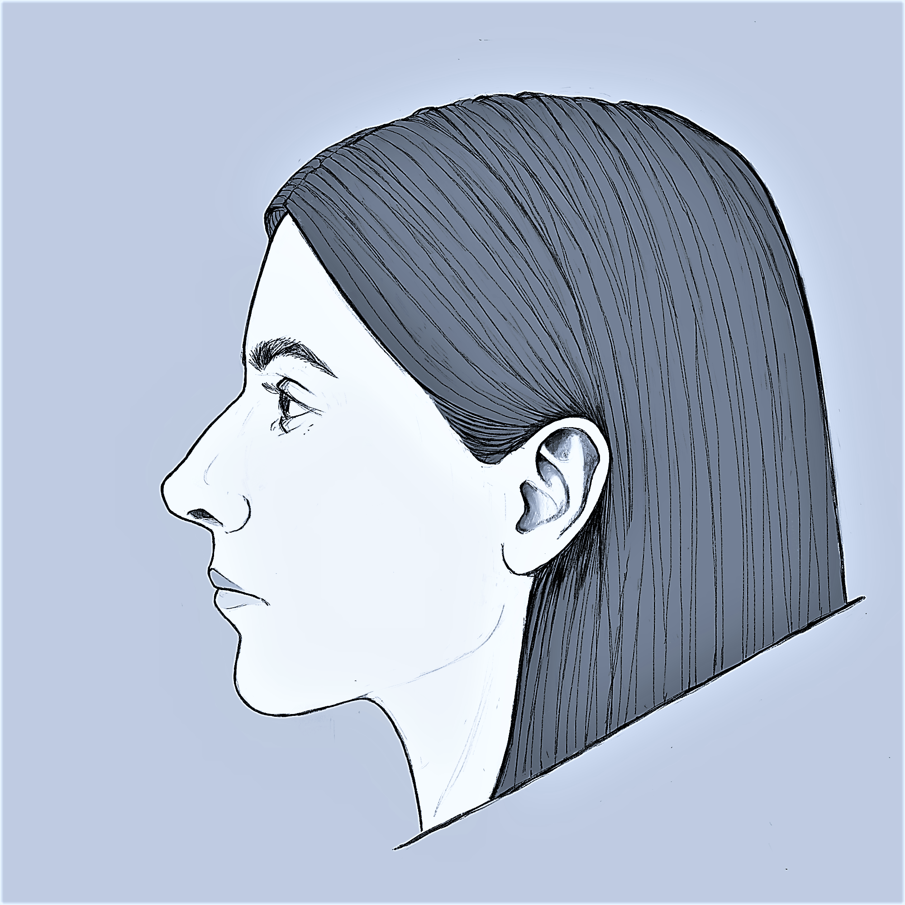

# Oksana Semenova

## Contacts
* **E-mail:** oxanacode@gmail.com
* **Telegram:** @oxvsem

## About Me
I'm a web and mobile designer who decided to become Frontend Developer.  

## Code example
```javascript
function encode(word){  
  let simbols = word.toLowerCase().split(''); 
  return simbols
          .map(a => simbols.includes(a, simbols.indexOf(a)+1) ? ')' :'(')
          .join('');
}
```
## Skills
* HTML
* CSS/SASS
* JavaScript
* Git
* Figma
* Adobe Photoshop, Illustrator

## Education
* **RS-School** (in progress)
* **[HTML Academy](https://htmlacademy.ru/study)**
    * HTML & CSS
* **University:**
    * Tomsk State University
        * UX/UI Design
    * The Peoples' Friendship University of Russia
        * Applied Mathematics and Informatics

## Languages
* **English** - B2
* **Russian** - native speaker
